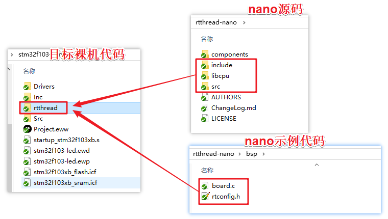
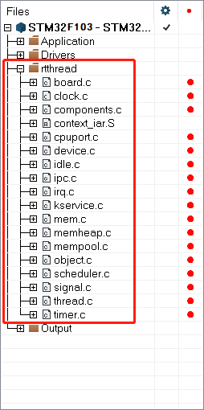
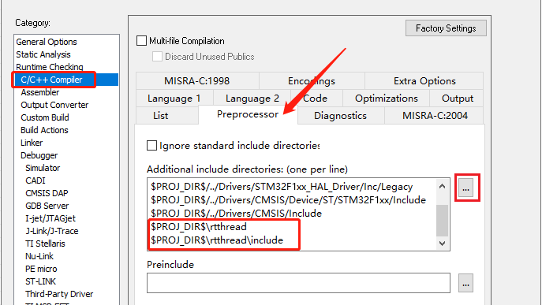
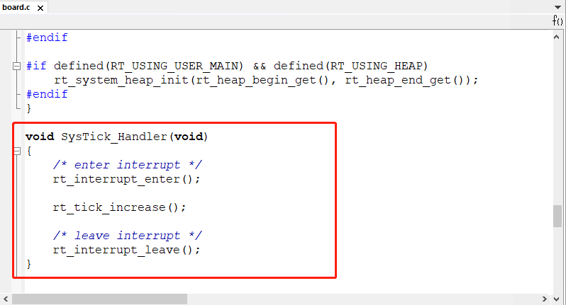
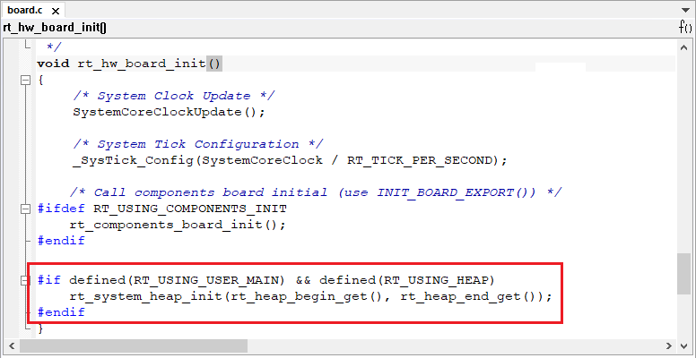
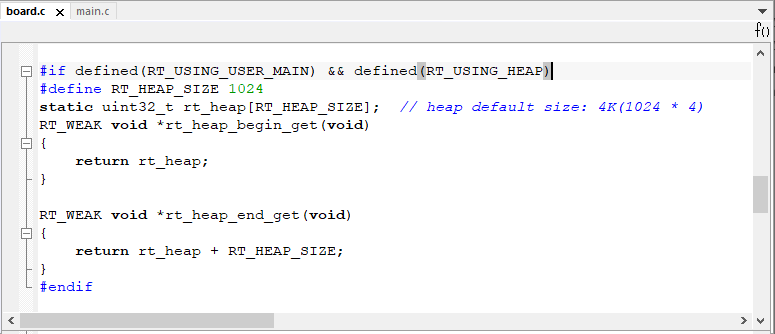
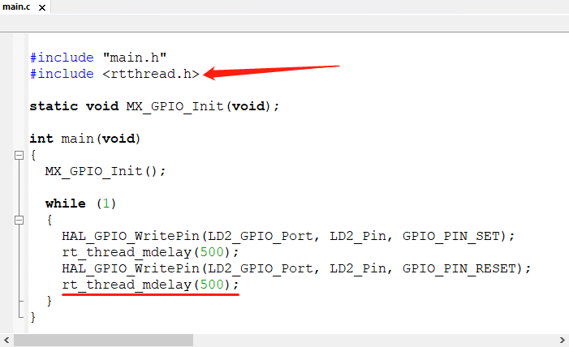

# Porting RT-Thread Nano on IAR

This document describes how to port RT-Thread Nano on IAR, using an example project based on the stm32f103.

## Porting Steps for Nano

1. Prepare a basic IAR project and obtain the RT-Thread Nano source code from the compressed package.
2. Add RT-Thread Nano source code to the base project and include the necessary header file paths.
3. Adapt Nano, focusing on adaptation in areas such as interrupts, clocks, memory, and applications to achieve porting.
4. Finally, configure Nano: Nano is customizable, and configuration is achieved through the `rtconfig.h` configuration file.

## Preparation

- Download the RT-Thread Nano release version code.
- Prepare a basic bare-metal source code project, such as an LED blinking example.

### Download Nano Source Code

[Click here](https://www.rt-thread.org/download/nano/rt-thread-3.1.3.zip) to download RT-Thread Nano source code.

### Prepare the Base Project ###

Before porting RT-Thread Nano, you need to prepare a bare-metal project that runs correctly. In this example, we use an LED blinking program based on STM32F103. The main screenshot of the program is as follows:


In our example, system initialization and LED blinking functions are mainly implemented. After compiling and downloading the program, you should see the LED on the development board blinking. Readers can prepare a similar bare-metal project based on their needs and the chip they are using.

## Add RT-Thread Nano to the Project ##

### Add Nano Source Files

Under the prepared IAR bare-metal project, create an `rtthread` folder and add the following files:

- The `include`, `libcpu`, and `src` folders from the Nano source code.
- Configuration files: two files in the `rtthread/bsp` folder of the source code: `board.c` and `rtconfig.h`.



Double-click to open the IAR bare-metal project, create an `rtthread` group, and add the following source code under this group:

- Add all files in the `rtthread/src/` folder to the project.
- Add the CPU porting files and context switching files corresponding to the CPU in the `rtthread/libcpu/` folder: `cpuport.c` and `context_iar.S`.
- Add `board.c` from the `rtthread/` folder.



Cortex-M CPU kernel porting code:

```
context_iar.s
cpuport.c
```

Kernel files include:

```
clock.c
components.c
device.c
idle.c
ipc.c
irq.c
kservice.c
mem.c
mempool.c
object.c
scheduler.c
thread.c
timer.c
```

Board-level configuration code:

```
board.c
```

### Add Header File Paths

Click `Project -> Options...` to enter the interface shown below, and add the path to the location of the `rtconfig.h` header file and the header file paths under the `include` folder.



## Adapt RT-Thread Nano ##

### Interrupts and Exception Handling

RT-Thread takes over the exception handling functions `HardFault_Handler()` and `PendSV_Handler()`. Since these two functions have been implemented by RT-Thread, you need to delete these functions from the interrupt service routine (ISR) files in the project to avoid duplicate definitions during compilation. If there are no function redefinition errors during compilation, no modifications are needed.

### System Clock Configuration

System clock configuration and OS Tick configuration need to be implemented in `board.c`. This includes configuring the system clock to provide a working clock for the MCU and peripherals, and configuring the OS Tick for the operating system heartbeat or tick. The following code shows the initialization of HAL library with `HAL_Init()`, configuration of the system clock with `SystemClock_Config()`, updating the system clock with `SystemCoreClockUpdate()`, and configuring the OS Tick with `_SysTick_Config()`. The OS Tick uses the SysTick timer for implementation, and the user needs to implement the `SysTick_Handler()` ISR in `board.c`, calling `rt_tick_increase()` provided by RT-Thread, as shown in the following figure.

```c
/* board.c */
void rt_hw_board_init()
{
    HAL_Init();
    SystemClock_Config();

    /* System Clock Update */
    SystemCoreClockUpdate();

    /* System Tick Configuration */
    _SysTick_Config(SystemCoreClock / RT_TICK_PER_SECOND);

    /* Call components board initial (use INIT_BOARD_EXPORT()) */
#ifdef RT_USING_COMPONENTS_INIT
    rt_components_board_init();
#endif

#if defined(RT_USING_USER_MAIN) && defined(RT_USING_HEAP)
    rt_system_heap_init(rt_heap_begin_get(), rt_heap_end_get());
#endif
}
```



Since the `SysTick_Handler()` ISR is re-implemented by the user in `board.c` for the OS Tick, the original `SysTick_Handler()` in the ISR files of the project also needs to be deleted to avoid duplicate definitions during compilation. If there are no function redefinition errors during compilation, no modifications are needed.

### Memory Heap Initialization

Initialization of the system memory heap is done in the `rt_hw_board_init()` function in `board.c`. Whether the memory heap functionality is used depends on the macro `RT_USING_HEAP`. RT-Thread Nano does not enable the memory heap functionality by default, which helps maintain a smaller code size without allocating space for the memory heap.

Enabling the system heap allows the use of dynamic memory features such as `rt_malloc`, `rt_free`, and various APIs for dynamically creating objects. If you need to use the system memory heap functionality, enable the `RT_USING_HEAP` macro definition in `rtconfig.h`. The initialization function `rt_system_heap_init()` will be called in this case, as shown below:



Initializing the memory heap requires the starting and ending addresses of the heap as parameters. The system default uses an array as the heap and obtains the starting and ending addresses of the heap. The size of this array can be manually changed, as shown below:



Note: After enabling heap dynamic memory functionality, the default heap size is relatively small. It may need to be increased when in use to avoid issues such as memory allocation failure or thread creation failure. There are two ways to modify it:

- Directly modify the size defined in the array, `RT_HEAP_SIZE`, making sure it is at least greater than the sum of the sizes of various dynamically allocated memory but less than the total RAM size of the chip.
- Refer to the [RT-Thread Nano Porting Principle - Implementing Dynamic Memory Heap](../nano-port-principle/an0044-nano-port-principle.md) section for modification, using the end of the RAM ZI section as the starting address of the heap and the end address of the RAM as the ending address of the heap. This method represents the maximum value that the heap can be set to.

## Write the First Application

After porting RT-

Thread Nano, you can start writing the first application code. At this point, the `main()` function becomes a thread in the RT-Thread operating system. You can now implement the first application in the `main()` function: blinking the on-board LED. Here, we directly modify the bare-metal LED indicator for demonstration.

1. Add the relevant RT-Thread header file `<rtthread.h>` at the beginning of the file.
2. Implement LED blinking code in the `main()` function (in the main thread): initialize the LED pin and toggle the LED in a loop.
3. Replace the delay function with RT-Thread's provided delay function `rt_thread_mdelay()`. This function triggers the operating system to perform scheduling, switching to other threads during the delay, demonstrating the real-time characteristics of threads.



After compiling the program and downloading it to the chip, you should see the program running based on RT-Thread, with the LED blinking normally.

> [!NOTE]
> Note: After adding RT-Thread, the `main()` function in the bare-metal code automatically becomes the entry function for the main thread of the RT-Thread system. Since threads cannot monopolize the CPU indefinitely, using `while(1)` in `main()` at this point requires an action to yield the CPU, such as using `rt_thread_mdelay()` series functions to yield the CPU.

**Differences from the Bare-Metal LED Blinking Application Code**:

1. Different delay functions: RT-Thread provides the `rt_thread_mdelay()` function, which triggers the operating system to perform scheduling. When this function is called for delay, the current thread does not occupy the CPU, and the scheduler switches to other threads. In contrast, the delay function in bare-metal continuously occupies the CPU.

2. Different location for initializing the system clock: After porting RT-Thread Nano, there is no need to perform corresponding system configurations (such as HAL initialization, clock initialization, etc.) in `main()`. This is because RT-Thread has already done system configurations such as system clock initialization during system startup, as explained in the previous section "System Clock Configuration".

## Configure RT-Thread Nano ##

Users can configure the desired features by opening or closing macro definitions in the `rtconfig.h` file. Below is a code snippet from `rtconfig.h`:

```c
...

// <h>IPC(Inter-process communication) Configuration
// <c1>Using Semaphore
//  <i>Using Semaphore
#define RT_USING_SEMAPHORE
// </c>
// <c1>Using Mutex
//  <i>Using Mutex
//#define RT_USING_MUTEX                 // Enable mutex usage by uncommenting this macro
// </c>
// <c1>Using Event
//  <i>Using Event
//#define RT_USING_EVENT                 // Enable event set usage by uncommenting this macro
// </c>
// <c1>Using MailBox
//  <i>Using MailBox
//#define RT_USING_MAILBOX              // Enable mailbox usage by uncommenting this macro
// </c>
// <c1>Using Message Queue
//  <i>Using Message Queue
//#define RT_USING_MESSAGEQUEUE          // Enable message queue usage by uncommenting this macro
// </c>
// </h>

// <h>Memory Management Configuration
// <c1>Using Memory Pool Management
//  <i>Using Memory Pool Management
//#define RT_USING_MEMPOOL              // Enable memory pool usage by uncommenting this macro

...
```

If the `RT_USING_HEAP` macro is not enabled, only static creation of tasks, semaphores, etc., is supported. If dynamic creation of objects is required, enable the `RT_USING_HEAP` macro definition in the `rtconfig.h` file. For a complete configuration, refer to [RT-Thread Nano Configuration](../nano-config/an0043-nano-config.md).
