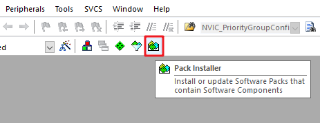
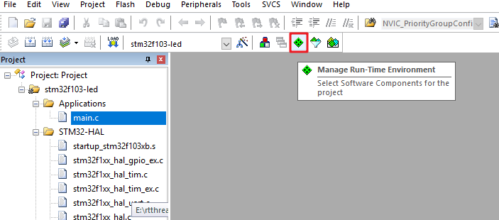
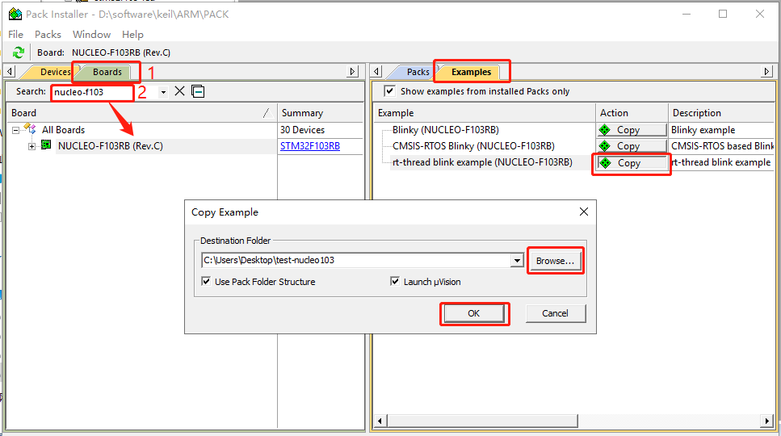
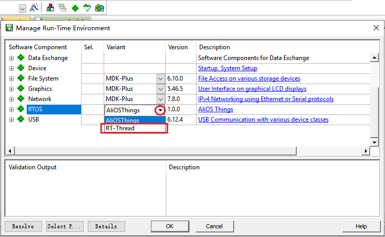

# Porting RT-Thread Nano on Keil MDK

This document introduces how to port RT-Thread Nano on Keil MDK using an STM32F103 base project as an example.

RT-Thread Nano is integrated into Keil MDK and can be directly added through the IDE. This document explains how to port RT-Thread Nano using MDK and provides an example with an STM32F103 base project.

Key steps for porting Nano:

1. Prepare a basic Keil MDK project and install the RT-Thread Nano pack.
2. Add RT-Thread Nano source code to the base project.
3. Adapt Nano, focusing on adapting interrupts, clocks, and memory to achieve porting.
4. Verify the porting result: write the first application code to blink an LED based on RT-Thread Nano.
5. Optionally configure Nano: Nano is customizable; configuration is done through the rtconfig.h configuration file.

## Preparation

- Prepare a basic bare-metal source code (can be created using STM32CubeMx visual software or manually following project documentation) such as an STM32 LED blinking example.
- Install RT-Thread Nano Pack on KEIL.

### Prepare the Base Project

Before porting RT-Thread Nano, a functioning bare-metal project needs to be prepared. In this example, an LED blinking program based on STM32F103 is used. The main screenshot of the program is as follows:


This example initializes the system and implements LED blinking. After compiling and downloading the program, the LED should blink. Readers can prepare a similar bare-metal project according to their chip requirements.

### Nano Pack Installation

Nano Pack can be installed either through the Keil MDK IDE or manually. Below are explanations for both methods.

#### Method 1: Installation in IDE

Open the MDK software and click on the Pack Installer icon in the toolbar:



Click on the Packs on the right, expand Generic, and find RealThread::RT-Thread under it. Click on the Install action corresponding to the Action column to install the Nano Pack online. Additionally, if other versions need to be installed, expand RealThread::RT-Thread and choose the version. The arrow indicates the installed version.


#### Method 2: Manual Installation

The installation file can be downloaded from the official website [RT-Thread Nano Offline Installation Package](https://www.rt-thread.org/download/mdk/RealThread.RT-Thread.3.1.5.pack). After downloading, double-click the file to install:


## Adding RT-Thread Nano to the Project

Open the prepared bare-metal program that can run, and add RT-Thread to the project. Click on Manage Run-Time Environment as shown below:



In the Manage Run-Time Environment, find RTOS under "Software Component," select RT-Thread under Variant, check the kernel, and click OK to add the RT-Thread kernel to the project.


Now, under Project, you can see that RT-Thread RTOS has been added. Expand RTOS, and you can see the added files:


For Cortex-M core porting code:

```c
context_rvds.s
cpuport.c
```

Kernel files include:

```c
clock.c
components.c
device.c
idle.c
ipc.c
irq.c
kservice.c
mem.c
mempool.c
object.c
scheduler.c
thread.c
timer.c
```

Configuration files:

```c
board.c
rtconfig.h
```

## Adapting RT-Thread Nano

### Interrupts and Exception Handling

RT-Thread takes over the exception handling functions `HardFault_Handler()` and `PendSV_Handler()`. Since these functions are already implemented by RT-Thread, you need to delete these functions from the interrupt service routine files in the project to avoid duplicate definitions during compilation. If there are no function redefinition errors when compiling the project, no modifications are needed.

### System Clock Configuration

System clock configuration (`SystemClock_Config()`) and OS tick configuration for MCU and peripherals are needed in the board.c file. The user should call `rt_os_tick_callback()` periodically in the timer interrupt service function to implement the OS tick. For Cortex-M architecture, use `SysTick_Handler()`:

```c
/* board.c */

void rt_os_tick_callback(void)
{
  rt_interrupt_enter();

  rt_tick_increase();

  rt_interrupt_leave();
}

void SysTick_Handler()
{
    rt_os_tick_callback();
}

void rt_hw_board_init(void)
{
  /*
   * TODO 1: OS Tick Configuration
   * Enable the hardware timer and call the rt_os_tick_callback function
   * periodically with the frequency RT_TICK_PER_SECOND.
   */

  HAL_Init();
  SystemClock_Config();
  SystemCoreClockUpdate();

  SysTick_Config(SystemCoreClock / RT_TICK_PER_SECOND);

  /* Call components board initial (use INIT_BOARD_EXPORT()) */
#ifdef RT_USING_COMPONENTS_INIT
  rt_components_board_init();
#endif

#if defined(RT_USING_USER_MAIN) && defined(RT_USING_HEAP)
  rt_system_heap_init(rt_heap_begin_get(), rt_heap_end_get());
#endif
}
```


Since the `SysTick_Handler()` interrupt service routine is re-implemented by the user in board.c for system OS tick, the original `SysTick_Handler()` function already implemented in the project needs to be deleted to avoid duplicate definitions during compilation. If there are no function redefinition errors when compiling the project, no modifications are needed.

### Memory Heap Initialization

The initialization of the system memory heap is done in the `rt_hw_board_init()` function in board.c. The use of the memory heap depends on the `RT_USING_HEAP` macro. By default, RT-Thread Nano does not enable the memory heap feature to keep a smaller size. To enable the heap and use dynamic memory functions like `rt_malloc` and `rt_free`, the `RT_USING_HEAP` macro needs to be defined. The `rt_system_heap_init()` function is called for heap initialization. The user needs to provide the start and end addresses of the heap. If the heap feature is not needed, it is safe to keep it disabled.


Note: When enabling the heap feature, the default heap size is small. It may need to be increased to prevent memory allocation or thread creation failures. Two ways to modify it:

- Directly modify the size defined in the array (`RT_HEAP_SIZE`). It should be at least larger than the sum of various dynamic memory sizes and smaller than the total RAM size of the chip.
- Refer to the [RT-Thread Nano Porting Principle](../nano-port-principle/an0044-nano-port-principle.md) section and use the end of the RAM ZI segment as the starting address of HEAP and the end address of RAM as the end address of HEAP, allowing the heap to be set to the maximum value.

## Writing the First Application

After successfully porting RT-Thread Nano, you can start writing the first application code to verify the porting result. At this

 point, the `main()` function becomes the entry point for the main thread in the RT-Thread operating system. Now you can implement the first application in the `main()` function, such as blinking an onboard LED, which can be modified directly based on the bare-metal LED blinking example.

1. Add the relevant RT-Thread header file `<rtthread.h>` at the beginning of the file.
2. Implement LED blinking code in the `main()` function (main thread) – initialize the LED pin and toggle the LED in a loop.
3. Replace delay functions with RT-Thread provided delay functions like `rt_thread_mdelay()`. This function induces system scheduling, switching to other threads, and reflects the real-time characteristics of the thread.


After compiling the program and downloading it to the chip, you should observe the program running based on RT-Thread, and the LED should blink.

> [!NOTE]
> Note: After adding RT-Thread, the `main()` function in the bare-metal project automatically becomes the entry function for the main thread in the RT-Thread system. Since threads cannot monopolize the CPU continuously, using `while(1)` in `main()` requires actions to yield the CPU, such as using `rt_thread_mdelay()`. 

**Differences from the bare-metal LED blinking application code**:

1. Different delay functions: RT-Thread provides the `rt_thread_mdelay()` function, which induces system scheduling. When this function is called for delay, the current thread does not occupy the CPU, and the scheduler switches to other threads. In contrast, the delay function in bare-metal continuously occupies the CPU.

2. Different location for initializing the system clock: After porting RT-Thread Nano, there is no need to perform additional system configurations (such as HAL initialization and clock initialization) in the `main()` function. This is because RT-Thread has already handled system clock initialization and other configurations during system startup, as explained in the previous section on "System Clock Configuration."

## Configuring RT-Thread Nano

Users can configure RT-Thread Nano according to their needs by modifying the macro definitions in the `rtconfig.h` file.

By default, RT-Thread Nano does not enable the `RT_USING_HEAP` macro, so it only supports static creation of tasks, semaphores, etc. If dynamic creation of objects is required, users need to enable the `RT_USING_HEAP` macro in the `rtconfig.h` file.

The MDK Configuration Wizard can conveniently configure the project. The `Value` column can be used to select the corresponding functionality and modify related values, equivalent to directly modifying the `rtconfig.h` configuration file. For more detailed configuration, refer to [RT-Thread Nano Configuration](../nano-config/an0043-nano-config.md).


## Obtaining Example Code

RT-Thread Nano integrated into Keil MDK comes with example code. To refer to the example code, open the relevant example code project in Keil.

First, click on the Pack Installer and enter the interface shown below:



Switch to the Examples in the right interface, then search for Device or Boards on the left interface. Click on the searched chip or development board, and you will see all the example codes related to it. You can also find RT-Thread's example code there. Click on Copy, choose a path, and click OK to open the example code project.

## Common Issues

### Q: How to upgrade the pack?

**A**: The pack upgrade steps are similar to software packages. Expand RealThread::RT-Thread, choose a newer version of Nano, and click Install to upgrade. In the figure below, click on Install indicated by the red arrow to upgrade. The rectangle represents the installed package, and click on Remove to uninstall.

> Note: If multiple versions are installed simultaneously, only the higher version can be selected when adding Nano to the project.


### Q: After installing the pack, the RT-Thread pack is not found as an option.

**A**: Click on the dropdown arrow as shown in the figure below to find RT-Thread, and select RT-Thread.



### Q: When selecting the shell while adding Nano, compilation errors occur.

**A**: Refer to [Adding Console and FinSH to RT-Thread Nano](../finsh-port/an0045-finsh-port.md) for details.