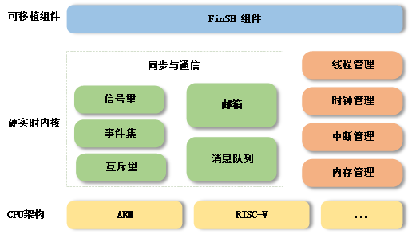

# Introduction to RT-Thread Nano

RT-Thread Nano is an extremely lightweight real-time kernel developed in the C language. It adopts an object-oriented programming paradigm, possesses a well-crafted code style, and serves as a configurable, preemptive, real-time multitasking RTOS. With minimal memory footprint, its features include task management, software timers, semaphores, mailboxes, and real-time scheduling, making it suitable for a wide range of applications in the 32-bit ARM entry-level MCU domain, including home appliances, consumer electronics, medical devices, and industrial control.

The software diagram below illustrates the RT-Thread Nano architecture, encompassing supported CPU architectures, kernel source code, and a detachable FinSH component:



**Supported Architectures:** ARM (Cortex M0/M3/M4/M7, etc.), RISC-V, and others.

**Features:** Thread management, inter-thread synchronization and communication, clock management, interrupt management, and memory management.

## Features of Nano

### Simplicity

**1. Easy Download**

RT-Thread Nano is integrated as a software package in Keil MDK and CubeMX. The Nano package source code can be directly downloaded within the software. For detailed instructions, refer to [Porting RT-Thread Nano based on Keil MDK](nano-port-keil/an0039-nano-port-keil.md) and [Porting RT-Thread Nano based on CubeMX](nano-port-cube/an0041-nano-port-cube.md).

Alternatively, the [Nano source code compressed package](https://www.rt-thread.org/download/nano/rt-thread-3.1.3.zip) is available for porting RT-Thread Nano to other development environments, such as [Porting RT-Thread Nano based on IAR](nano-port-iar/an0040-nano-port-iar.md).

**2. Simple Code**

Unlike the complete version of RT-Thread, Nano excludes the Scons build system, eliminates the need for Kconfig and Env configuration tools, and removes the device framework and components unique to the full version. It is a pure kernel.

**3. Easy Porting**

Due to Nano's minimalist nature, the porting process is extremely straightforward. Adding Nano source code to a project completes 90% of the porting work.

In Keil MDK and CubeMX, Nano's software package can be downloaded and added to the project with a single click. Additionally, in RT-Thread Studio, projects can be created directly using Nano. The following methods can be selected when using different development environments to port or use Nano:

- [Using RT-Thread Nano on RT-Thread Studio](nano-port-studio/an0047-nano-port-studio.md)
- [Porting RT-Thread Nano based on KEIL MDK](nano-port-keil/an0039-nano-port-keil.md)
- [Porting RT-Thread Nano based on CubeMX](nano-port-cube/an0041-nano-port-cube.md)
- [Porting RT-Thread Nano based on IAR](nano-port-iar/an0040-nano-port-iar.md)
- [Porting RT-Thread Nano to RISC-V](nano-port-gcc-riscv/an0042-nano-port-gcc-riscv.md)

**4. Simple Usage**

RT-Thread Nano is also straightforward to use, providing a friendly development experience.

- Easy customization: Nano's configuration file is rtconfig.h, listing all macro definitions in the kernel. Some defaults are not enabled; to use them, simply open the corresponding definitions. For specific configurations, refer to the [RT-Thread Nano Configuration](nano-config/an0043-nano-config.md) tutorial.
- Easy addition of FinSH components: The [FinSH component](../../programming-manual/finsh/finsh.md) can be easily ported to Nano without relying on the device framework. Only two necessary functions need to be connected to complete the [FinSH porting](finsh-port/an0045-finsh-port.md).
- Optional driver libraries: Manufacturers' firmware driver libraries, such as ST's STD library, HAL library, LL library, etc., can be selected.
- Comprehensive documentation: Includes [Kernel Basics](../../programming-manual/basic/basic.md), [Thread Management (Examples)](../../programming-manual/thread/thread.md), [Clock Management (Examples)](../../programming-manual/timer/timer.md), [Inter-thread Synchronization (Examples)](../../programming-manual/ipc1/ipc1.md), [Inter-thread Communication (Examples)](../../programming-manual/ipc2/ipc2.md), [Memory Management (Examples)](../../programming-manual/memory/memory.md), [Interrupt Management](../../programming-manual/interrupt/interrupt.md), and porting tutorials for Nano modules.

### Compactness

**Low Resource Consumption:** Minimal impact on RAM and ROM. Even when supporting semaphore and mailbox features and running two threads (main thread + idle thread), Nano maintains an extremely small footprint, occupying approximately 1K of RAM and 4K of ROM.

An example of Nano resource usage: Running two threads (main thread + idle thread) in a Cortex M3-based MDK project compilation result (optimization level 3):

```
    Total RO  Size (Code + RO Data)                 4000 (   3.91kB)
    Total RW  Size (RW Data + ZI Data)              1168 (   1.14kB)
    Total ROM Size (Code + RO Data + RW Data)       4092 (   4.00kB)
```

> Note: For richer components, drivers, and package functionalities, it is recommended to use the [complete version of RT-Thread](../../index.md).

### Open Source and Free (Apache 2.0)

RT-Thread Nano real-time operating system adheres to the Apache License 2.0. The real-time operating system kernel and all open-source components can be freely used in commercial products without the need to disclose application source code, eliminating potential commercial risks.