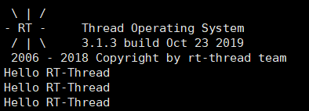
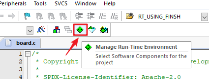
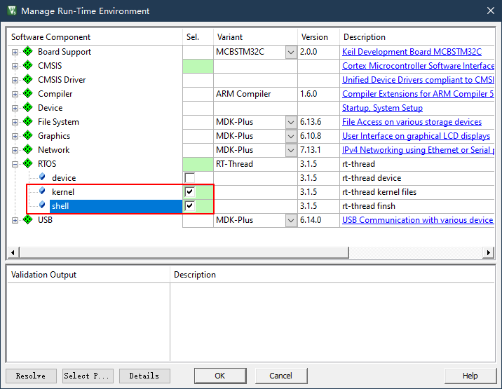
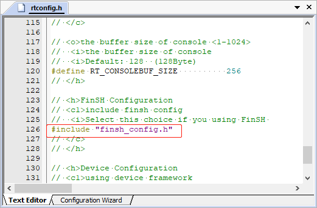
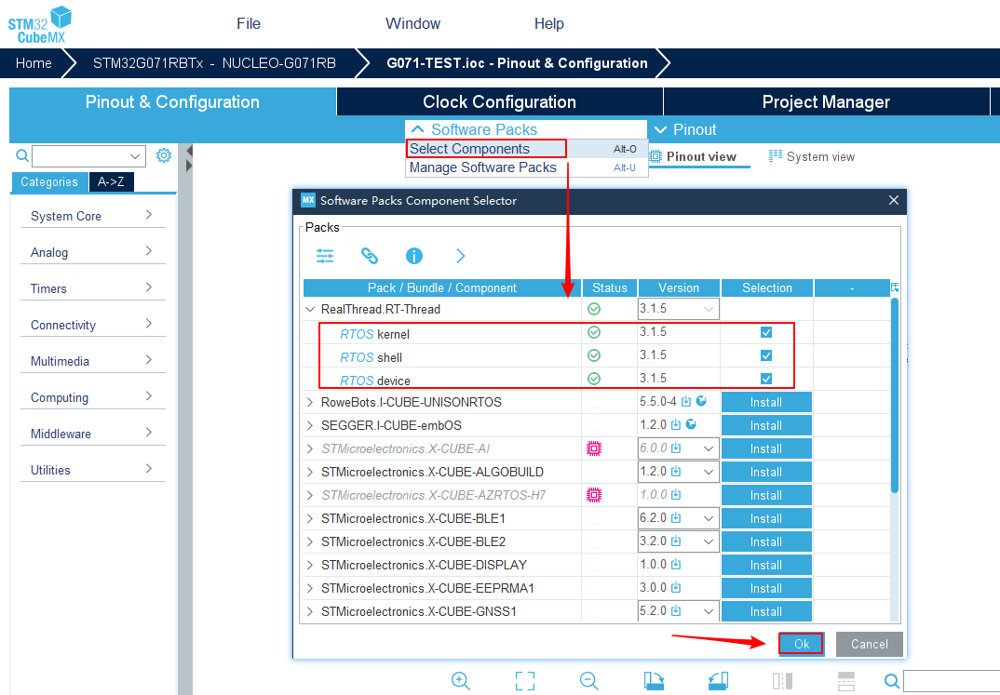
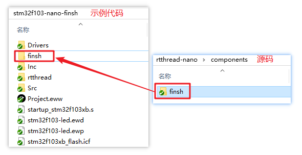
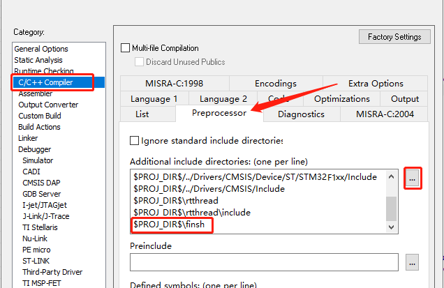
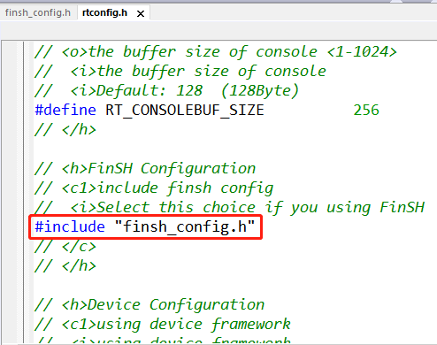

# Adding Console and FinSH on RT-Thread Nano

This document is divided into two parts:
- The first part is to add UART console (implementing printing): used to print information to the console for debugging. This part only requires the implementation of two functions, UART initialization, and system output function, to achieve UART console printing functionality.
- The second part is to port the FinSH component (implementing command input): used for entering commands in the console to debug the system. The implementation of this part is based on the first part, requiring the addition of FinSH component source code and another system input function for integration.

The following will explain these two parts in detail.

## Adding UART Console on Nano (Implementing Printing)

After adding UART console printing functionality on RT-Thread Nano, you can use the RT-Thread provided print function `rt_kprintf()` in the code to print information, facilitating debugging and obtaining the current system status. Implementing console printing (make sure the `RT_USING_CONSOLE` macro is enabled in `rtconfig.h`) requires basic hardware initialization and integration with a system output function. This section will provide detailed explanations.

### Implementing UART Initialization

Note: This part corresponds to the `#error TODO 2` section in version 3.1.5: `#error "TODO 2: Enable the hardware uart and config baudrate."`

To use UART for console output, the UART needs to be initialized first, including configuring parameters such as pins and baud rate. The UART initialization function `uart_init()` has two calling methods:

1. Method 1: Automatically initialize using the macro `INIT_BOARD_EXPORT()`, no explicit call is needed.
2. Method 2: Explicitly call `uart_init()`, which should be called in the `rt_hw_board_init()` function in `board.c`.

```c
/* Implementation 1: Initialize UART */
static int uart_init(void);
```

**Example code:** The following is an example code based on the HAL library for the STM32F103 UART driver. It completes the implementation of adding the console for UART. This example is for reference only.

```c
static UART_HandleTypeDef UartHandle;
static int uart_init(void)
{
    /* Initialize UART parameters such as baud rate, stop bits, etc. */
    UartHandle.Instance = USART1;
    UartHandle.Init.BaudRate   = 115200;
    UartHandle.Init.HwFlowCtl  = UART_HWCONTROL_NONE;
    UartHandle.Init.Mode       = UART_MODE_TX_RX;
    UartHandle.Init.OverSampling = UART_OVERSAMPLING_16;
    UartHandle.Init.WordLength = UART_WORDLENGTH_8B;
    UartHandle.Init.StopBits   = UART_STOPBITS_1;
    UartHandle.Init.Parity     = UART_PARITY_NONE;

    /* Initialize UART pins, etc. */
    if (HAL_UART_Init(&UartHandle) != HAL_OK)
    {
        while(1);
    }

    return 0;
}
INIT_BOARD_EXPORT(uart_init);  /* Choose initialization method 1: using the macro INIT_BOARD_EXPORT for automatic initialization */
```

```c
/* board.c */
void rt_hw_board_init(void)
{
    ....
    uart_init();   /* Choose initialization method 2: call uart_init directly in rt_hw_board_init */
    ....
}
```

### Implementing rt_hw_console_output

Note: This part corresponds to the `#error TODO 3` section in version 3.1.5: `#error "TODO 3: Output the string 'str' through the uart."`

Implement the function `rt_hw_console_output()` to output a character through UART, which is a system function, and its function name cannot be changed.

```c
/* Implementation 2: Output a character, a system function, the function name cannot be changed */
void rt_hw_console_output(const char *str);
```

> [!NOTE]
> Note: RT-Thread system prints are terminated with `\n`, not `\r\n`. Therefore, when outputting a character, `\r` needs to be output before `\n` to achieve both carriage return and newline. Otherwise, the printed information will only have a newline.

**Example code:** The following is an example code for integrating `rt_hw_console_output()` with the STM32F103 HAL UART driver. It implements console character output, and the example is for reference only.

```c
void rt_hw_console_output(const char *str)
{
    rt_size_t i = 0, size = 0;
    char a = '\r';

    __HAL_UNLOCK(&UartHandle);

    size = rt_strlen(str);
    for (i = 0; i < size; i++)
    {
        if (*(str + i) == '\n')
        {
            HAL_UART_Transmit(&UartHandle, (uint8_t *)&a, 1, 1);
        }
        HAL_UART_Transmit(&UartHandle, (uint8_t *)(str + i), 1, 1);
    }
}
```

### Result Verification

Write code with `rt_kprintf()` prints in the application, compile, download, and open a serial assistant for verification. The example below prints "Hello RT-Thread" every 1 second in the `main()` function:



## Adding FinSH Component on Nano (Implementing Command Input)

[RT-Thread FinSH](https://www.rt-thread.org/document/site/programming-manual/finsh/finsh/) is RT-Thread's command-line component (shell), providing a set of operation interfaces for users to call on the command line, mainly for debugging or viewing system information. It can communicate with a PC via UART / Ethernet / USB. The implementation of FinSH functionality on Nano involves the following steps:

1. Add FinSH source code to the project.
2. Implement function integration.

### Adding FinSH Source Code to the Project

#### Adding FinSH Source Code in KEIL

Click "Manage Run-Environment":



Check "shell," which will automatically add the FinSH component source code to the project:



Then, in `rtconfig.h`, enable relevant FinSH options, as shown in the following image:



#### Adding FinSH Source Code in Cube MX

Open a Cube project, click "Additional Software," and in the "Pack Vendor" section, check "RealThread" to quickly locate the RT-Thread software package. Then, check "shell" in the RT-Thread software package to add FinSH component source code to the project.



In the generated code, find `rtconfig.h` and enable `#include "finsh_config.h"`.

Note: In version 3.1.5, `rtconfig.h` already includes relevant macro definitions from `finsh_config.h`. Therefore, choose either method and comment out the

 duplicate macro definitions.

#### Adding FinSH Source Code in Other IDEs

To add FinSH source code in other IDEs, manually add FinSH source code and header file paths to the project. Using IAR IDE as an example:

1. Copy the FinSH source code from the Nano source code directory under `rtthread-nano/components` to the project, as shown in the following image:

   

2. Add the FinSH source code to the project (create a FinSH group if needed). Add all `.c` files from the `finsh` folder to the project:

   ```
   cmd.c
   msh.c
   shell.c
   finsh_port.c
   ```

3. Add the header file path of the `finsh` folder (click `Project -> Options...` to add, as shown below):

   

4. In `rtconfig.h`, enable `#define RT_USING_FINSH` to activate FinSH, as shown below:

   

### Implementing rt_hw_console_getchar

Note: This part corresponds to the `#error TODO 4` section in version 3.1.5: `#error "TODO 4: Read a char from the uart and assign it to 'ch'."`

To implement the full functionality of FinSH, allowing both printing and command input, the console has already implemented the printing function. Now, it needs to integrate the console input function in the `board.c` file to enable character input:

```c
/* Implementation 3: Get a character for FinSH, a system function, the function name cannot be changed */
char rt_hw_console_getchar(void);
```

- `rt_hw_console_getchar()`: Console function to get a character. Implement UART character input in this function. You can use either polling or interrupt-based methods to get characters. The interrupt method is recommended.

**Example code:** The following is an example code based on the STM32F103 HAL UART driver for `rt_hw_console_getchar()`. It integrates with the FinSH component, and the example is for reference only. Note that this example uses a polling method for character retrieval; consider implementing an interrupt-based method for better performance.

```c
char rt_hw_console_getchar(void)
{
    char ch = 0;

    /* Retrieve data from the ring buffer */
    while (rt_ringbuffer_getchar(&uart_rxcb, (rt_uint8_t *)&ch) != 1)
    {
        rt_sem_take(&shell_rx_sem, RT_WAITING_FOREVER);
    }
    return ch;
}

/* UART interrupt */
void USART2_IRQHandler(void)
{
    int ch = -1;
    rt_base_t level;
    /* Enter interrupt */
    rt_interrupt_enter();

    if ((__HAL_UART_GET_FLAG(&(UartHandle), UART_FLAG_RXNE) != RESET) &&
        (__HAL_UART_GET_IT_SOURCE(&(UartHandle), UART_IT_RXNE) != RESET))
    {
        while (1)
        {
            ch = -1;
            if (__HAL_UART_GET_FLAG(&(UartHandle), UART_FLAG_RXNE) != RESET)
            {
                ch =  UartHandle.Instance->DR & 0xff;
            }
            if (ch == -1)
            {
                break;
            }
            /* Read data and store it in the ring buffer */
            rt_ringbuffer_putchar(&uart_rxcb, ch);
        }
        rt_sem_release(&shell_rx_sem);
    }

    /* Leave interrupt */
    rt_interrupt_leave();
}

/* UART GPIO initialization */
#define USART_TX_Pin GPIO_PIN_2
#define USART_RX_Pin GPIO_PIN_3

void HAL_UART_MspInit(UART_HandleTypeDef *huart)
{
    GPIO_InitTypeDef GPIO_InitStruct = {0};
    if (huart->Instance == USART2)
    {
        __HAL_RCC_USART2_CLK_ENABLE();

        __HAL_RCC_GPIOA_CLK_ENABLE();
        /**USART2 GPIO Configuration
        PA2     ------> USART2_TX
        PA3     ------> USART2_RX
        */
        GPIO_InitStruct.Pin = USART_TX_Pin | USART_RX_Pin;
        GPIO_InitStruct.Mode = GPIO_MODE_AF_PP;
        GPIO_InitStruct.Speed = GPIO_SPEED_FREQ_LOW;
        HAL_GPIO_Init(GPIOA, &GPIO_InitStruct);
    }
}
```

## Common Issues

### Q: Can `rt_kprintf()` print floating-point numbers?

A: No, it cannot. However, you can achieve the printing of floating-point numbers by other means, such as multiplying the value by a certain factor and printing the integer and fractional parts separately.

### Q: When implementing the complete functionality of FinSH, I cannot input commands.


A: Possible reasons include: UART driver not implementing the character input function, FinSH component not being enabled, etc. If HEAP is enabled, check if the HEAP size is sufficient, as insufficient HEAP size can lead to failure in creating the tshell thread.

### Q: Hard fault occurs.

A: Check the stack utilization of each thread after `ps`. If a thread shows 100% utilization, it indicates that the thread's stack is too small, and the stack size should be increased.

### Q: Error when using AC6 for compilation.

A: This may be caused by incorrect assembly file recognition, where the file is recognized as a C file. Right-click on the file, change the file type to assembly, and recompile.