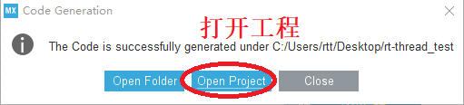

# Porting RT-Thread Nano based on CubeMX

This document explains how to port RT-Thread Nano based on CubeMX and outlines the steps to generate the code project.

RT-Thread Nano is already integrated into CubeMX and can be directly added from the IDE. This document describes how to port RT-Thread Nano using CubeMX, using an example of an stm32f103 basic project.

## Preparation

- Download Cube MX 5.0 from [https://www.st.com/en/development-tools/stm32cubemx.html](https://www.st.com/en/development-tools/stm32cubemx.html).
- Download the RT-Thread Nano pack from CubeMX.

### Nano pack installation

To get the RT-Thread Nano software package, you need to add [https://www.rt-thread.org/download/cube/RealThread.RT-Thread.pdsc](https://www.rt-thread.org/download/cube/RealThread.RT-Thread.pdsc) to CubeMX.

Follow these steps: open CubeMX, go to the `help` menu, enter the `Manage embedded software packages` interface, click the `From Url` button, go to the `User Defined Packs Manager` interface, click `new`, enter the above URL, then click `check`, as shown below:


After `check`, click OK to return to the `User Defined Packs Manager` interface, click OK again, CubeMX will automatically connect to the server to get the package description file. Go back to the `Manage embedded software packages` interface, and you will find the `RT-Thread Nano 3.1.5` package. Select the package, click `Install Now`, as shown below:


After clicking install, a `Licensing Agreement` will pop up. Agree to the agreement and click `Finish`, as shown below:


Wait for the installation to complete. After successful installation, the small blue box in front of the version will turn into a filled yellow-green color, as shown below:


At this point, the RT-Thread Nano package is installed. Exit the `Manage embedded software packages` interface and go to the CubeMX main interface.

### Create a basic project

In the CubeMX main interface, go to the `File` menu and select `New Project`, as shown below:


After creating the project, in the pop-up chip model interface, enter a specific chip model for easy searching, double-click on the selected chip, as shown below:


The clock tree configuration can be used as default. Then, configure the download method.

## Add RT-Thread Nano to the project

### Select Nano components

After selecting the chip model, click `Softwares Packages` -> `Select Components`, enter the component configuration interface, select `RealThread`, then select the RT-Thread component according to your needs, and click OK, as shown below:


> Note: The RT-Thread Nano package includes kernel, shell, and device components. Only selecting the kernel means using only the RT-Thread kernel, and kernel code will be added to the project. Selecting kernel and shell means using FinSH Shell component on top of RT-Thread Nano, and both kernel code and FinSH component code will be added to the project. Selecting device means using the rt-thread device framework. After users write and register peripheral drivers based on this framework, they can use the device unified interface to operate peripherals.

### Configure Nano

After selecting the component, configure the component parameters. In the project interface `Pinout & Configuration`, enter the configured component parameter configuration area, as shown below:


### Project management

Name the project, select the location for storing code, and select the `Toolchain/IDE` for generating code. `Cube MX` can generate projects not only for `Keil4/Keil5` but also for IDEs such as `IAR7/IAR8`. This document chooses MDK5 from the drop-down menu, as shown below:


### Configure MCU

Configure the MCU features as needed.

## Adapt RT-Thread Nano

### Interrupts and Exception Handling

RT-Thread operating system redefines `HardFault_Handler`, `PendSV_Handler`, `SysTick_Handler` interrupt functions. To avoid duplicate definitions, before generating the project, deselect the three interrupt functions (corresponding to the commented options `Hard fault interrupt`, `Pendable request`, `Time base: System tick timer`) in the interrupt configuration, and finally click to generate code, as shown below:


Wait for the project to generate, click to open the project, as shown below, to enter the MDK5 project.



### System clock configuration

System clock configuration and OS Tick configuration (providing heartbeats/ticks for the operating system) need to be implemented in `board.c`.

The following code initializes the HAL library with `HAL_Init()`, configures the system clock with `SystemClock_Config()`, updates the system clock with `

SystemCoreClockUpdate()`, and configures OS Tick with `_SysTick_Config()`. Here, OS Tick uses the systick timer for implementation, and users need to implement the interrupt service routine `SysTick_Handler()` in `board.c`, calling `rt_tick_increase()` provided by RT-Thread, as shown below.

```c
/* board.c */
void rt_hw_board_init()
{
    HAL_Init();
    SystemClock_Config();

    /* System Clock Update */
    SystemCoreClockUpdate();

    /* System Tick Configuration */
    _SysTick_Config(SystemCoreClock / RT_TICK_PER_SECOND);

    /* Call components board initial (use INIT_BOARD_EXPORT()) */
#ifdef RT_USING_COMPONENTS_INIT
    rt_components_board_init();
#endif

#if defined(RT_USING_USER_MAIN) && defined(RT_USING_HEAP)
    rt_system_heap_init(rt_heap_begin_get(), rt_heap_end_get());
#endif
}
```


### Memory heap initialization

Initialization of the system memory heap is completed in the `rt_hw_board_init()` function in `board.c`. Whether the system heap function is used depends on whether the macro `RT_USING_HEAP` is enabled. RT-Thread Nano does not enable the memory heap function by default, keeping a smaller size to avoid allocating space for the heap.

Enabling the system heap allows the use of dynamic memory functions such as `rt_malloc`, `rt_free`, and various APIs for dynamically creating objects. If you want to use the system memory heap function, enable the `RT_USING_HEAP` macro definition. The `rt_system_heap_init()` function for initializing the memory heap will be called, as shown below:


Initializing the memory heap requires two parameters, the starting address and ending address of the heap. The system defaults to using an array as the heap and obtains the starting and ending addresses of the heap. The size of this array can be manually changed, as shown below:


Note: After enabling the heap dynamic memory function, the default value of the heap is relatively small. When using it, you need to increase it; otherwise, there may be failures in memory allocation or thread creation. You can modify it in two ways:

- You can directly modify the size of the `RT_HEAP_SIZE` defined in the array, at least greater than the sum of the sizes of various dynamically allocated memories but less than the total size of the chip's RAM.
- You can refer to the modification in [RT-Thread Nano Porting Principle - Implementing Dynamic Memory Heap](../nano-port-principle/an0044-nano-port-principle.md) to use the end of the RAM ZI segment as the starting address of the HEAP and the end of the RAM as the ending address of the HEAP. This is the maximum value that the heap can be set.

## Write the first application

After porting RT-Thread Nano, you can start writing the first application code. At this point, the `main()` function becomes the entry function of the main thread of the RT-Thread operating system. You can now implement the first application: blinking the onboard LED.

1. Include the relevant header file `<rtthread.h>` at the beginning of the file.
2. In the `main()` function (the main thread), write the LED blinking code: initialize the LED pin, light up/extinguish the LED in a loop.
3. Use the RT-Thread provided delay function `rt_thread_mdelay()`, which causes the operating system to be scheduled and switches to run other threads. This reflects the real-time characteristics of threads.


After compiling the program and downloading it to the chip, you can see the program based on RT-Thread running, and the LED is blinking normally.

> [!NOTE]
> Note: After adding RT-Thread, the main() function in bare-metal mode will automatically become the entry function of the main thread of the RT-Thread system. Because threads cannot occupy the CPU all the time, when using `while(1)` in main(), there needs to be an action to yield the CPU, such as using `rt_thread_mdelay()`. 

**Differences from the bare-metal LED blinking application code**:

1). Different delay functions: The RT-Thread provided `rt_thread_mdelay()` function can cause the operating system to schedule. When calling this function for delay, the current thread will not occupy the CPU, and the scheduler will switch to run other threads. In contrast, the delay function in bare-metal mode continuously occupies the CPU.

2). Different positions for initializing the system clock: After porting RT-Thread Nano, there is no need to configure the system in main() (such as HAL initialization, clock initialization, etc.), because RT-Thread has done the system clock initialization and other configurations during system startup. This was explained in the previous section "System Clock Configuration".

## Configure RT-Thread Nano

Configuration of RT-Thread Nano can be done in the section `Add RT-Thread Nano -> Configure Nano` as mentioned in the previous section `Adding RT-Thread Nano -> Configure Nano` before generating the project. If you want to configure directly in the IDE of the target project after generating it, modify the `rtconfig.h` file in the project. For a complete configuration, refer to [RT-Thread Nano Configuration](../nano-config/an0043-nano-config.md).

## Common Issues

### Q: Three interrupts are defined repeatedly.

**A**: Refer to the section on generating the project and the subsection on interrupt configuration.

### Q: The generated project does not include RT-Thread.

**A**: It may be because RT-Thread Nano components were not added to the project. Refer to the section on generating the project and the subsection on selecting Nano components.

### Q: When adding Nano with the shell selected, compiling the project reports an error.

**A**: Error "Undefined symbol rt_hw_console_getchar (referrred from shell.o)". This is because after adding the FinSH component source code, you need to define and implement this function yourself to complete the porting of FinSH. Refer to [Adding Console and FinSH on RT-Thread Nano](../finsh-port/an0045-finsh-port.md) for details.

### Q: The generated project does not include .S files.

**A**: If you find that `context_rvds.S`, `context_iar.S`, or other files are missing in the generated project, it is recommended to regenerate the project using CubeMX.

### Q: Checking the URL fails.

**A**: It is recommended to upgrade CubeMX to version 5.0 or above.

### Q: How to upgrade CubeMX.

**A**: This document was created based on CubeMX 5.0.0. If you have a lower version, it is recommended to upgrade. Upgrade by selecting `help -> Check for updates`, and after entering, click Refresh. CubeMX will automatically obtain the latest program. After successfully obtaining it, select the version and click `Install now`, then wait for the installation to complete.