# Porting RT-Thread Nano to RISC-V

This document describes how to port RT-Thread Nano to the RISC-V architecture, using the Eclipse GCC environment as an example and based on a basic project using the GD32V103 MCU as a reference.

Main steps for porting Nano:

1. Prepare a basic Eclipse project and obtain the RT-Thread Nano source code archive.
2. Add RT-Thread Nano source code to the basic project, along with the necessary header file paths.
3. Adapt Nano, focusing on aspects such as interrupts, clocks, memory, and applications to achieve porting.
4. Optionally configure Nano: Nano is customizable, and you can tailor the system by modifying the configuration file `rtconfig.h`.

## Preparation

- Download the RT-Thread Nano release code.
- Prepare a basic bare-metal source code project, such as an LED blink example.

### Download Nano Source Code

[Click here](https://www.rt-thread.org/download/nano/rt-thread-3.1.3.zip) to download the RT-Thread Nano source code.

### Prepare the Basic Project

Before porting RT-Thread Nano, you need a functional bare-metal project. In this example, we use an LED blink program based on the GD32V103 as a reference. The main screenshot of the program is as follows:

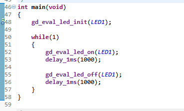

This example initializes the system and implements LED blinking. After compiling and downloading the program, you should see the LED on the development board blinking. You can customize a similar bare-metal project based on your needs and the chip you are using.

## Add RT-Thread Nano to the Project

### Add Nano Source Files

In the prepared Eclipse project, create a folder named `rtthread` and add the following files:

- Include the `include`, `libcpu`, and `src` folders from Nano source code. Note that the `libcpu` folder should only contain files relevant to the chip architecture, such as `bumblebee` and `common` in the example.
- Configuration files: two files from the `bsp` folder of the example code, namely `board.c` and `rtconfig.h`.

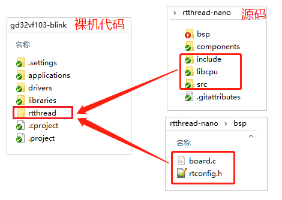

Reopen the Eclipse workspace, import the project, and RT-Thread is now integrated into the project:

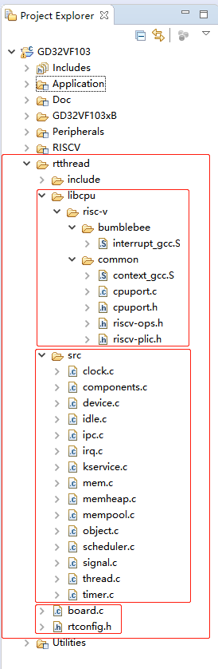

Cortex-M core porting code:

```c
context_gcc.s
cpuport.c
```

Kernel files include:

```c
clock.c
components.c
device.c
idle.c
ipc.c
irq.c
kservice.c
mem.c
mempool.c
object.c
scheduler.c
thread.c
timer.c
```

Board-specific configuration code and configuration files:

```c
board.c
rtconfig.h
```

### Add Header File Paths

Right-click on the project, click on `Properties` to enter the interface shown below. Click on `C/C++ Build` -> `Settings` and add the header file paths for both assembly and C: add the path to the location of the `rtconfig.h` header file and the header file path under the `include` folder. Then click on `C/C++ General` -> `Path and Symbols` and add the corresponding header files. Finally, click Apply.

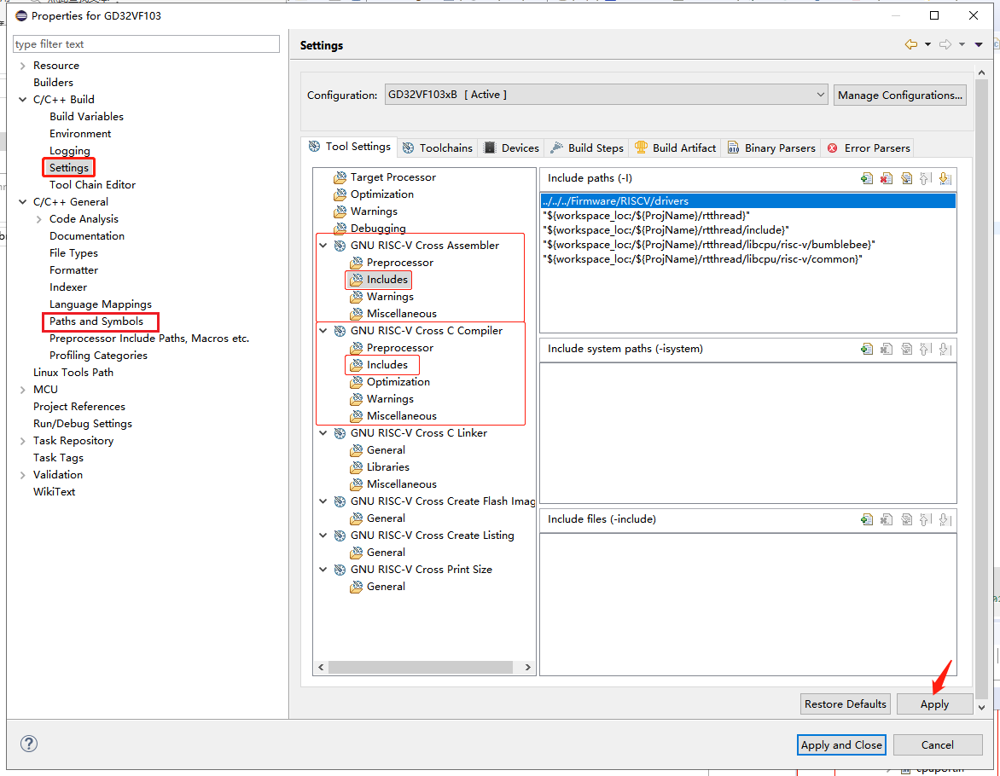

## Adapt RT-Thread Nano

### Modify start.S

Modify the startup file to implement the startup of RT-Thread: Since RT-Thread Nano starts in the GCC environment with the `entry()` function calling the startup function `rt_thread_startup()`, you need to modify the startup file `start.S` to jump to the `entry()` function when starting, rather than jumping to `main()`. This ensures the startup of RT-Thread.

```c
/* RT-Thread startup in GCC environment */
int entry(void)
{
    rt_thread_startup();
    return 0;
}
```

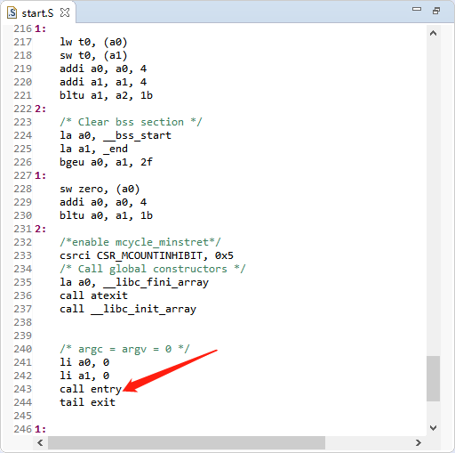

### Interrupts and Exception Handling

RT-Thread provides methods for managing interrupts. When the system does not implement a vector table-like feature, and physical interrupts need to be associated with user interrupt service routines, the interrupt management interface must be used to manage interrupts. This way, when an interrupt occurs, the corresponding interrupt service routine can be triggered.

The GD32F103 chip used in this example provides an interrupt vector table in the startup file. Users can directly use the functions provided by the interrupt vector for IRQ implementation. When an interrupt is triggered, the processor directly determines which interrupt source it is and jumps to the corresponding fixed location for processing without the need to implement interrupt management.

### System Clock Configuration

System clock configuration and OS Tick configuration (heartbeat / timebase for the operating system) need to be implemented in `board.c`.

Configuration examples are shown in the figures below. The `riscv_clock_init()` function configures the system clock, and `ostick_config()` configures the OS Tick.

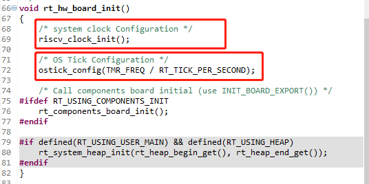

The `riscv_clock_init()` function configures the system clock as follows:

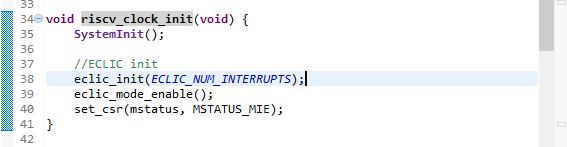

`ostick_config()` configures the OS Tick. In this example, OS Tick is implemented using a hardware timer, and users need to implement the interrupt service routine (`eclic_mtip_handler()`) for this hardware timer in `board.c` and call `rt_tick_increase()` provided by RT-Thread.

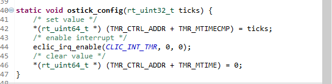

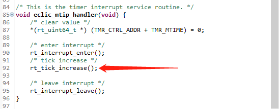

Since the `eclic_mtip_handler()` ISR is implemented by the user in `board.c` for the OS Tick, it is necessary to remove the custom `eclic_mtip_handler` to avoid duplicate definitions during compilation. If there is no function redefinition error when compiling the project at this point, no modification is required.

### Memory Heap Initialization

Initialization of the system memory heap is completed in the `rt_hw_board_init()` function in `board.c`. Whether the memory heap function is enabled depends on the `RT_USING_HEAP` macro. RT-Thread Nano does not enable the memory heap function by default to keep a smaller footprint without allocating space for the heap.

Enabling the system heap allows the use of dynamic memory functions such as `rt_malloc`, `rt_free`, and various APIs for dynamically creating objects. To use the system memory heap function, enable the `RT_USING_HEAP` macro. The initialization function `rt_system_heap_init()` will be called, as shown below:

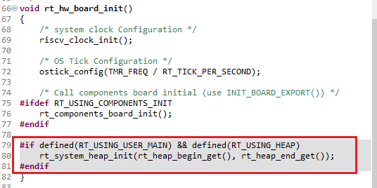

Initializing the memory heap requires two parameters: the starting address and ending address of the heap. The system uses an array as the heap by default and obtains the starting and ending addresses of the heap. The size of this array can be manually adjusted, as shown below:

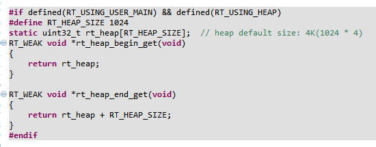

Note: After enabling the heap dynamic memory function, it is necessary to adjust the default value of the heap, which may be too small. If the heap is not sufficiently large, there may be failures in memory allocation or thread creation. There are two ways to modify it:

- Directly modify the size of the `RT_HEAP_SIZE` defined in the array to be at least greater than the sum of the sizes

 of various dynamically allocated memory. However, it should be less than the total size of the chip's RAM.
- Refer to the chapter "Implementing Dynamic Memory Heap" in [RT-Thread Nano Porting Principles](../nano-port-principle/an0044-nano-port-principle.md) for modification. Use the end of the RAM ZI segment as the starting address of HEAP and the end address of RAM as the ending address. This is the method to set the maximum value that the heap can be.

## Write the First Application

After successfully porting RT-Thread Nano, you can start writing the first application code. At this point, the `main()` function becomes the entry function of the main thread of the RT-Thread operating system. You can implement the first application in the `main()` function, such as blinking the on-board LED, directly based on the bare-metal LED indicator modification.

1. Add relevant RT-Thread header files `<rtthread.h>` at the beginning of the file.
2. Implement LED blinking code in the `main()` function (main thread): initialize the LED pin and toggle the LED in a loop.
3. Replace the delay function with the RT-Thread-provided delay function `rt_thread_mdelay()`. This function triggers the operating system scheduler, switching to other threads and demonstrating the real-time characteristics of the thread.

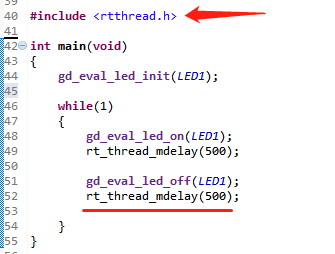

After compiling the program and downloading it to the chip, you should see the program running based on RT-Thread, with the LED blinking.

> [!NOTE]
> Note: After adding RT-Thread, the `main()` function in the bare-metal code automatically becomes the entry function of the main thread in the RT-Thread system. Since a thread cannot occupy the CPU continuously, when using `while(1)` in `main()`, there needs to be an action to yield the CPU, such as using `rt_thread_mdelay()` series functions to yield the CPU.

**Differences from the bare-metal LED blinking application code**:

1. Different delay functions: The `rt_thread_mdelay()` function provided by RT-Thread can trigger the operating system scheduler. When this function is called for delay, the current thread will not occupy the CPU, and the scheduler will switch to run other threads. In contrast, the delay function in bare-metal continuously occupies the CPU.

2. Different location for initializing the system clock: After porting RT-Thread Nano, there is no need to configure the system in `main()` (e.g., hal initialization, clock initialization, etc.), as RT-Thread has already configured system clock initialization during system startup, as explained in the "System Clock Configuration" section.

## Configure RT-Thread Nano

Users can configure RT-Thread Nano based on their needs by enabling or disabling macro definitions in the `rtconfig.h` file. Below is a snippet of code from `rtconfig.h`:

```c
...

// <h>IPC(Inter-process communication) Configuration
// <c1>Using Semaphore
//  <i>Using Semaphore
#define RT_USING_SEMAPHORE
// </c>
// <c1>Using Mutex
//  <i>Using Mutex
//#define RT_USING_MUTEX                 // Enable mutex usage by uncommenting this macro
// </c>
// <c1>Using Event
//  <i>Using Event
//#define RT_USING_EVENT                 // Enable event usage by uncommenting this macro
// </c>
// <c1>Using MailBox
//  <i>Using MailBox
//#define RT_USING_MAILBOX              // Enable mailbox usage by uncommenting this macro
// </c>
// <c1>Using Message Queue
//  <i>Using Message Queue
//#define RT_USING_MESSAGEQUEUE          // Enable message queue usage by uncommenting this macro
// </c>
// </h>

// <h>Memory Management Configuration
// <c1>Using Memory Pool Management
//  <i>Using Memory Pool Management
//#define RT_USING_MEMPOOL              // Enable memory pool usage by uncommenting this macro

...
```

For a complete configuration of RT-Thread Nano, refer to [RT-Thread Nano Configuration](../nano-config/an0043-nano-config.md).