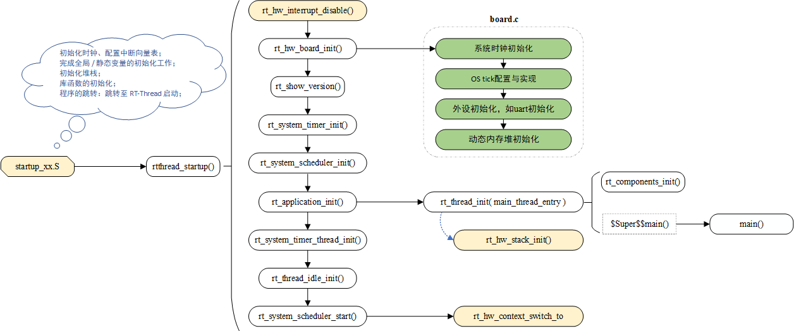

# RT-Thread Nano Porting Principles

This document introduces the principles of Nano porting, focusing on porting for different MCUs such as Cortex M, RISC-V, or other MCUs. The porting process is mainly divided into two parts: libcpu porting and board-level porting. Before discussing the porting, this document first explains the startup process and the directory structure of RT-Thread Nano.

## Startup Process

The startup process of RT-Thread is as follows. The colored parts in the diagram require special attention (yellow indicates content related to libcpu porting, and green indicates content related to board-level porting).



The unified entry point for RT-Thread startup code is `rtthread_startup()`. After the chip startup file completes necessary tasks such as initializing the clock, configuring the interrupt vector table, and initializing the stack, it eventually jumps to the entry point of RT-Thread during program execution. The RT-Thread startup process is as follows:

1. Disable global interrupts, initialize hardware related to the system.
2. Print system version information, initialize kernel objects (such as timers, schedulers).
3. Initialize the user's main thread (and initialize the thread stack), sequentially initialize various modules in the main thread.
4. Initialize software timer thread, initialize idle thread.
5. Start the scheduler, switch the system to the first thread to run (such as the main thread), and enable global interrupts.

## Porting Directory Structure

In the `rtthread-nano` source code, files related to porting are located in the paths marked with colors in the following diagram (yellow indicates files related to libcpu porting, and green indicates files related to board-level porting).


## libcpu Porting

The libcpu abstraction layer of RT-Thread provides a set of unified CPU architecture porting interfaces. This part of the interfaces includes global interrupt control functions, thread context switching functions, clock tick configuration and interrupt functions, Cache, and more. The CPU architectures supported by RT-Thread are located in the `libcpu` folder in the source code.

### Startup File startup.s

The startup file is provided by the chip manufacturer and is located in the chip's firmware library. Each chip has a corresponding startup file, and the startup files are different in different development environments. After integrating RT-Thread into the system, RT-Thread's startup is placed before calling the main() function. For example, in the GCC environment for the STM32, the startup file needs to be modified to jump to the `entry` function provided by RT-Thread instead of the main function.

Example snippet from the startup file for GCC:

```c
// Before modification:
  bl  SystemInit
  bl  main

// After modification:
  bl  SystemInit
  bl  entry  /* Modify here, change from main to entry */
```

In the `entry` function provided by RT-Thread, the RT-Thread startup is called:

```c
int entry(void)
{
    rtthread_startup();
    return 0;
}
```

Finally, the main() function is called to enter the user's main().

### Context Switch context_xx.S

Context switching refers to the CPU switching from one thread to another, or switching between threads and interrupts. During the context switching process, the CPU generally stops processing the current running code and saves the specific location of the current program execution to resume later.

In this file, in addition to implementing context switching functions, global interrupt control functions need to be implemented as well. See the "Implementing Global Interrupt Control" and "Implementing Context Switching" sections in the [Programming Manual - CPU Architecture Porting](../../../programming-manual/porting/porting/) for details.

| Functions to Implement                                       | Description                                                  |
| ------------------------------------------------------------ | ------------------------------------------------------------ |
| rt_base_t rt_hw_interrupt_disable(void);                     | Disable global interrupts                                    |
| void rt_hw_interrupt_enable(rt_base_t level);                | Enable global interrupts                                     |
| void rt_hw_context_switch_to(rt_uint32 to);                  | Context switch without source thread, called when starting the first thread in the scheduler and in signal handling |
| void rt_hw_context_switch(rt_uint32 from, rt_uint32 to);     | Switch from the from thread to the to thread, used for thread-to-thread switching |
| void rt_hw_context_switch_interrupt(rt_uint32 from, rt_uint32 to); | Switch from the from thread to the to thread, used when switching inside an interrupt |

Note: In Cortex-M, the PendSV interrupt handler is PendSV_Handler(), and the actual work of thread switching is done in PendSV_Handler().

### Thread Stack Initialization cpuport.c

In RT-Thread, each thread has an independent stack. When a thread switch occurs, the context of the current thread is saved in the stack. When the thread needs to resume execution, the context information is retrieved from the stack.

The fault exception handler rt_hw_hard_fault_exception() is executed when a hardware error occurs, triggered by the HardFault_Handler interrupt. This file mainly implements thread stack initialization rt_hw_stack_init() and the hard fault exception handling function. See the [Programming Manual - CPU Architecture Porting](../../../programming-manual/porting/porting/) for the parameters and implementation steps of the thread stack initialization function.

| Function to Implement        | Description                                   |
| ---------------------------- | --------------------------------------------- |
| rt_hw_stack_init()           | Implement thread stack initialization         |
| rt_hw_hard_fault_exception() | Exception function for system hardware errors |

### Interrupt and Exception Handling interrupt.c

> [!NOTE]
> Note: On the Cortex-M core, all interrupts are processed using an interrupt vector table. When an interrupt occurs, the processor directly determines which interrupt source triggered it, then jumps directly to the corresponding fixed location for processing. There is no need to implement interrupt management separately.

On some non-Cortex-M architectures, the system does not implement a function similar to an interrupt vector table. Physical interrupts need to be associated with user interrupt service routines using interrupt management interfaces. This allows triggering the corresponding interrupt and executing the interrupt service routine when an interrupt occurs.

See the [Interrupt Management](../../../programming-manual/interrupt/interrupt.md) section for details.

| Interrupt Management Interfaces to Implement | Description                                |
| -------------------------------------------- | ------------------------------------------ |
| rt_hw_interrupt_init()                       | Initialize hardware interrupts             |
| rt_hw_interrupt_install()                    | Attach interrupt service routines          |
| rt_hw_interrupt_mask()                       | Mask specified interrupt sources           |
| rt_hw_interrupt_umask()                      | Unmask previously masked interrupt sources |

## Board-level Porting board.c

> [!NOTE]
> Note: board.c and rtconfig.h are files related to hardware/board and need to be implemented during porting. For the Cortex-M architecture, you can refer to the existing board.c and rtconfig.h files in the Nano source code in the bsp folder.

Board-level porting mainly involves implementing the content of the `rt_hw_board_init()` function. This function, located in the board.c file, performs various necessary tasks during system startup. These tasks include:

1. Configuring the system clock.
2. Implementing OS ticks. (Steps 1 and 2 correspond to the `#error TODO 1` part in version 3.1.5: `#error "TODO 1: OS Tick Configuration."`)
3. Initializing peripherals such as GPIO/UART, if needed.


4. Initializing the system memory heap to enable dynamic heap memory management.
5. Board-level automatic initialization. Functions initialized using INIT_BOARD_EXPORT() will be initialized here.
6. Other necessary initializations, such as MMU configuration (implement if needed by calling the corresponding application function in the rt_hw_board_init function).

```c
/* board.c */
void rt_hw_board_init(void)
{
    /* Part 1: System initialization, system clock configuration, etc. */
    HAL_init();                // Some system-level initialization, add this part if needed
    SystemClock_Config();      // Configure the system clock
    SystemCoreClockUpdate();   // Update the system clock frequency SystemCoreClock

    /* Part 2: Configure the OS Tick frequency, implement OS ticks (and increment OS Tick in the interrupt service routine) */
    _SysTick_Config(SystemCoreClock / RT_TICK_PER_SECOND);

    /* Part 3: Initialize hardware peripherals, call if needed */
    uart_init();

    /* Part 4: System dynamic memory heap initialization */
#if defined(RT_USING_USER_MAIN) && defined(RT_USING_HEAP)
    rt_system_heap_init(rt_heap_begin_get(), rt_heap_end_get());
#endif

    /* Part 5: Initialize functions using INIT_BOARD_EXPORT() */
#ifdef RT_USING_COMPONENTS_INIT
    rt_components_board_init();
#endif

    /* Part 6: Other initializations */
}
```

### 1. Configure the System Clock

The system clock is the foundation for providing working clocks to various hardware modules. Configuration of the system clock is completed in the `rt_hw_board_init()` function and can be implemented using library functions or custom implementations.

Here is an example of configuring the system clock:

```c
/* board.c */
void rt_hw_board_init()
{
    /* Part 1: System initialization, system clock configuration, etc. */
    rt_hw_clock_init()    // Clock initialization, function name can be customized, such as SystemClock_Config()
    ...
}
```

### 2. Implement OS Ticks

OS ticks, also known as clock ticks, are essential for any operating system to handle all time-related events. The implementation of clock ticks is achieved by using a hardware timer to generate periodic interrupts. In the interrupt service routine, the `rt_tick_increase()` function is called to increment the global variable `rt_tick`. On Cortex-M, the internal SysTick timer is commonly used for this purpose.

Here is an example of configuring OS ticks for the STM32 in the `rt_hw_board_init()` function. After initializing the clock ticks, the `SysTick_Handler()` interrupt service routine is used to call `rt_tick_increase()`.

```c
/* board.c */
void rt_hw_board_init()
{
    ...
    /* Part 2: Configure OS Tick frequency and implement OS ticks (increment OS Tick in the interrupt service routine) */
    _SysTick_Config(SystemCoreClock / RT_TICK_PER_SECOND);  // Use SysTick to implement clock ticks
    ...
}

/* SysTick interrupt service routine */
void SysTick_Handler(void)
{
    /* enter interrupt */
    rt_interrupt_enter();

    rt_tick_increase();

    /* leave interrupt */
    rt_interrupt_leave();
}
```

For CPU architectures that use RT-Thread's interrupt management, the interrupt service routine needs to be installed using `rt_hw_interrupt_install()`. Here is an example of using a hardware timer for OS ticks and installing the interrupt service routine:

```c
/* board.c */
void rt_hw_board_init()
{
    ...
    /* Part 2: Configure OS Tick frequency and implement OS ticks (increment OS Tick in the interrupt service routine) */
    rt_hw_timer_init();      // Use hardware timer to implement clock ticks, usually named rt_hw_timer_init()
    ...
}

int rt_hw_timer_init(void)   // Implement this function and install the interrupt service routine
{
    ...
    rt_hw_interrupt_install(IRQ_PBA8_TIMER2_3, rt_hw_timer_isr, RT_NULL, "tick");
    rt_hw_interrupt_umask(IRQ_PBA8_TIMER2_3);
}

/* TIMER interrupt service routine */
static void rt_hw_timer_isr(int vector, void *param)
{
    rt_interrupt_enter();
    rt_tick_increase();
    rt_interrupt_leave();
}
```

> [!NOTE]
> Note: When initializing the OS ticks, the macro `RT_TICK_PER_SECOND` is used. By modifying this macro, the time length of one OS tick can be changed.

### 3. Hardware Peripheral Initialization

Hardware initialization, such as UART initialization (for connecting to the console), needs to be manually called in the `rt_hw_board_init()` function.

```c
/* board.c */
void rt_hw_board_init(void)
{
    ....
    /* Part 3: Initialize hardware peripherals, call if needed */
    uart_init();
    ....
}
```
Note that if `uart_init()` or other peripheral initialization functions are already initialized using the `INIT_BOARD_EXPORT()` macro, explicit calls in `rt_hw_board_init()` are not necessary. Choose one of the two initialization methods.

### 4. Implementing Dynamic Memory Heap

By default, RT-Thread Nano does not enable dynamic memory heap functionality. Enabling RT_USING_HEAP allows the use of dynamic memory features, including the utilization of functions such as rt_malloc, rt_free, and various APIs for dynamically creating objects. The initialization of dynamic memory heap management is achieved through the rt_system_heap_init() function. The initialization of the dynamic memory heap requires specifying the starting and ending addresses of the heap memory, and the function prototype is as follows:

```c
void rt_system_heap_init(void *begin_addr, void *end_addr)
```

Once RT_USING_HEAP is enabled, the system defaults to using an array as the heap. The starting and ending addresses of the heap are passed as parameters to the heap initialization function, rt_system_heap_init(), which is called within rt_hw_board_init().

When the heap is enabled, the system initially uses an array as the heap (the default heap size is relatively small; adjust it based on the chip's RAM conditions in practical usage). The obtained starting and ending addresses of the heap are passed as parameters to the heap initialization function:

```c
#define RT_HEAP_SIZE 1024
static uint32_t rt_heap[RT_HEAP_SIZE];
RT_WEAK void *rt_heap_begin_get(void)
{
    return rt_heap;
}

RT_WEAK void *rt_heap_end_get(void)
{
    return rt_heap + RT_HEAP_SIZE;
}

void rt_hw_board_init(void)
{
    ....
#if defined(RT_USING_USER_MAIN) && defined(RT_USING_HEAP)
    rt_system_heap_init(rt_heap_begin_get(), rt_heap_end_get());    // Pass the starting and ending addresses of the heap
#endif
    ....
}
```

If you prefer not to use an array as the dynamic memory heap, you can redefine the size of the system HEAP. For example, you can use the end of the RAM ZI section as the starting address of the HEAP (make sure it corresponds to the linker script) and the end address of the RAM as the ending address of the HEAP. This way, you can utilize all the unused RAM as dynamic memory heap. The following example redefines the starting and ending addresses of the HEAP and initializes the system HEAP with these parameters:

```c
#define STM32_SRAM1_START              (0x20000000)
#define STM32_SRAM1_END                (STM32_SRAM1_START + 20 * 1024)   // Ending address = 0x20000000 (base address) + 20K (RAM size)

#if defined(__CC_ARM) || defined(__CLANG_ARM)
extern int Image$$RW_IRAM1$$ZI$$Limit;                   // RW_IRAM1, must correspond to the runtime domain name in the linker script
#define HEAP_BEGIN      ((void *)&Image$$RW_IRAM1$$ZI$$Limit)
#endif

#define HEAP_END                       STM32_SRAM1_END
```

```c
void rt_hw_board_init(void)
{
    ....
#if defined(RT_USING_USER_MAIN) && defined(RT_USING_HEAP)
    rt_system_heap_init((void *)HEAP_BEGIN, (void *)HEAP_END);
#endif
    ....
}
```

#### Linker Script

A linker script, also known as a scatter-loading file, determines how to allocate the base address for relevant data when generating an image file. If a specific linker script is not specified, the linker will automatically use the default linker script to generate the image.

As an example, the linker script file (xxx.sct) for STM32 in the KEIL MDK development environment is provided:

```c
LR_IROM1 0x08000000 0x00020000  {    ; load region size_region
  ER_IROM1 0x08000000 0x00020000  {  ; load address = execution address
   *.o (RESET, +First)
   *(InRoot$$Sections)
   .ANY (+RO)
  }
  RW_IRAM1 0x20000000 0x00005000  {  ; RW data
   .ANY (+RW +ZI)
  }
}
```

In this script, `RW_IRAM1 0x20000000 0x00005000` defines a runtime domain RW_IRAM1 (default domain name) with a base address of 0x20000000 and a size of 0x00005000 (20K), corresponding to the actual RAM size. `.ANY (+RW +ZI)` indicates loading all matching target file's readable and writable data (RW-Data, ZI-Data). Therefore, the end of the memory occupied at runtime is the end of the ZI section, and the memory space after the ZI section's end can be utilized as the system dynamic memory heap.