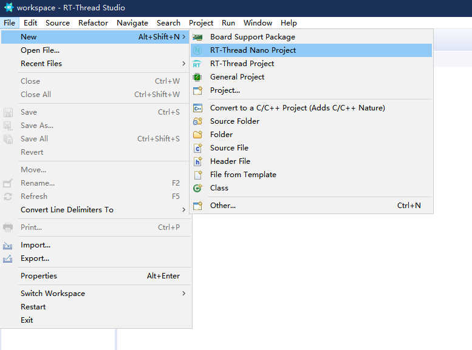
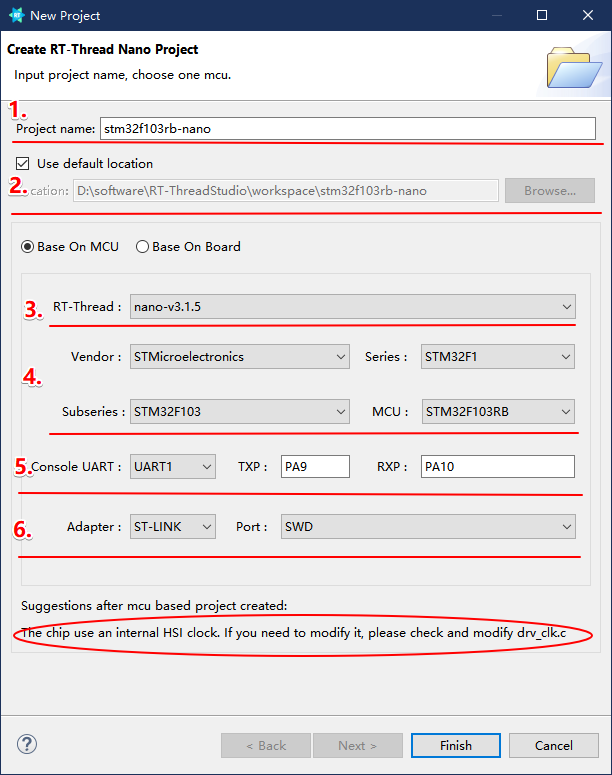
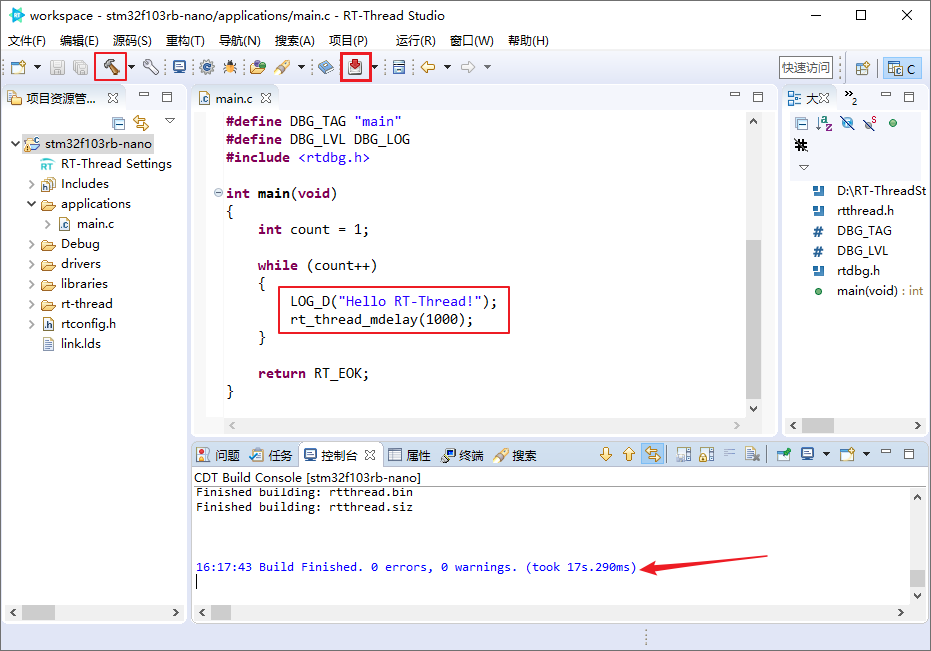
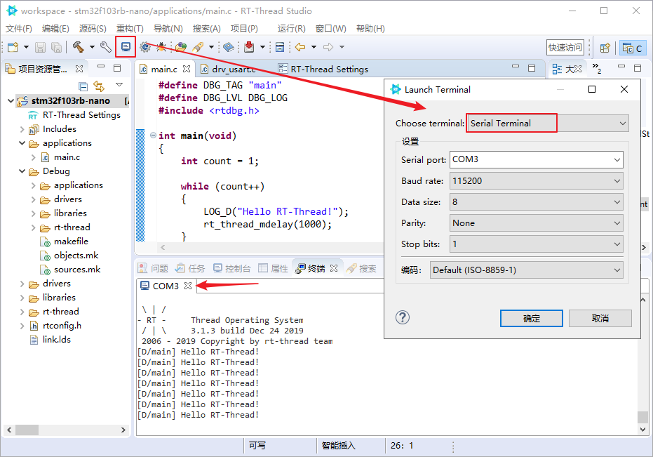
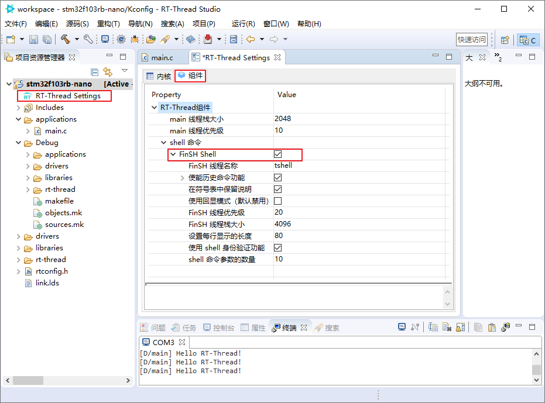
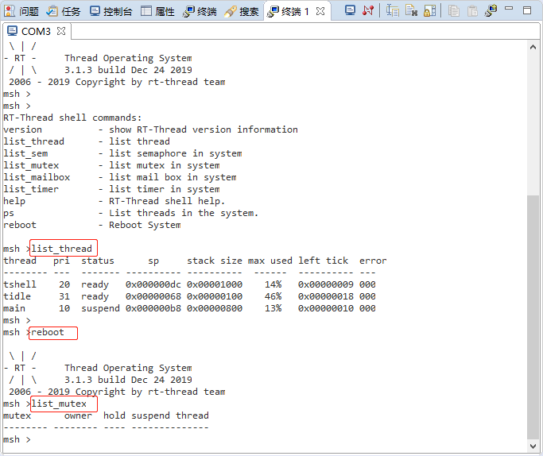

# Using RT-Thread Nano in RT-Thread Studio

This document provides a guide on how to use RT-Thread Nano in RT-Thread Studio, using the creation of a Nano project for the stm32f103RB as an example.

## Prerequisites

[Install RT-Thread Studio](https://www.rt-thread.org/studio.html).

## Create a Nano Project

Open the IDE and create a Nano project:

Navigate through the project creation wizard:

1. Set the project name.
2. Specify the project save path.
3. Choose the Nano version based on the chip.
4. Select the chip.
5. Configure the serial console and pin numbers.
6. Debug configuration.

The project uses the chip's internal HSI clock; if modification is needed, please edit drv_clk.c.

Note: You can modify the system clock by editing `SystemClock_Config()` in drv_clk.c.

Once the project is created, connect the hardware and proceed with compilation and download, as shown below:

As the console serial number and pin numbers are configured in the project wizard, the project already includes the uart driver and `rt_hw_console_output()`, enabling direct printing. Open the serial terminal to observe the printed output.

## Adding FinSH to Nano

Double-click on `RT-Thread Settings` to enter the configuration, open the components, and check FinSH Shell, then save the configuration. This action includes the FinSH component source code in the project.

The `rt_hw_console_getchar()` function is already implemented in drv_uart.c, eliminating the need to implement additional code for integrating with FinSH.

Connect the hardware, compile and download the project. In the serial terminal, press the Tab key to view the system commands:

## Frequently Asked Questions

### Q: How to modify the system clock?

A: You can modify the system clock by editing `SystemClock_Config()` in drv_clk.c.